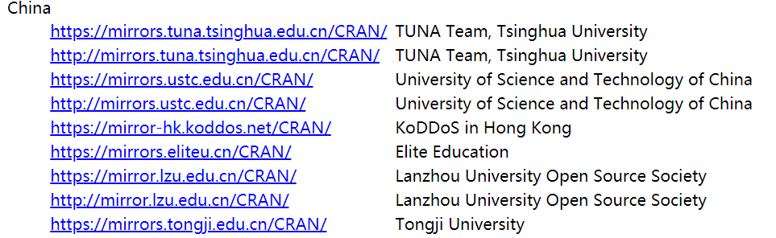
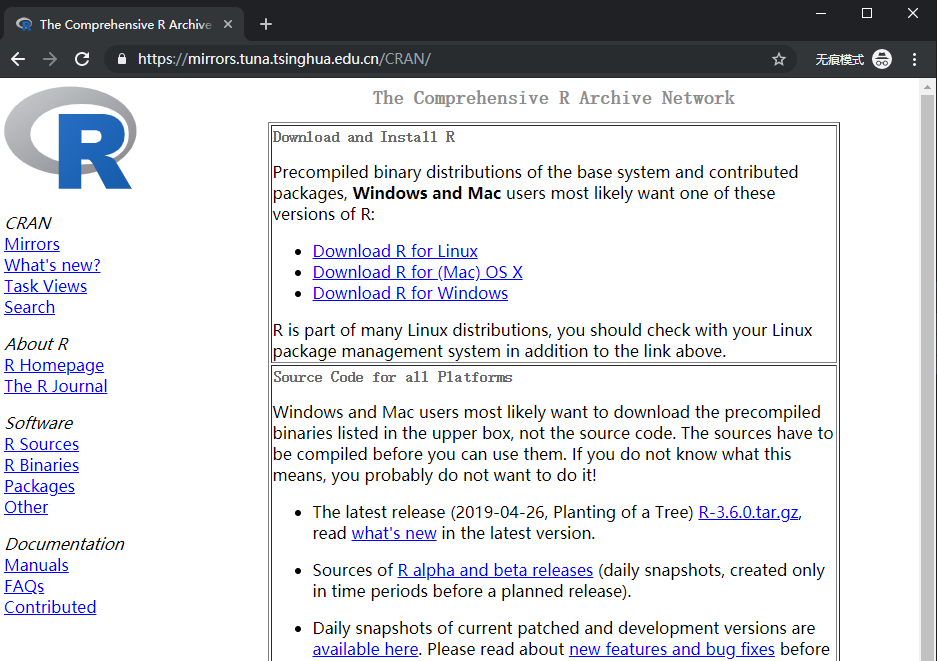
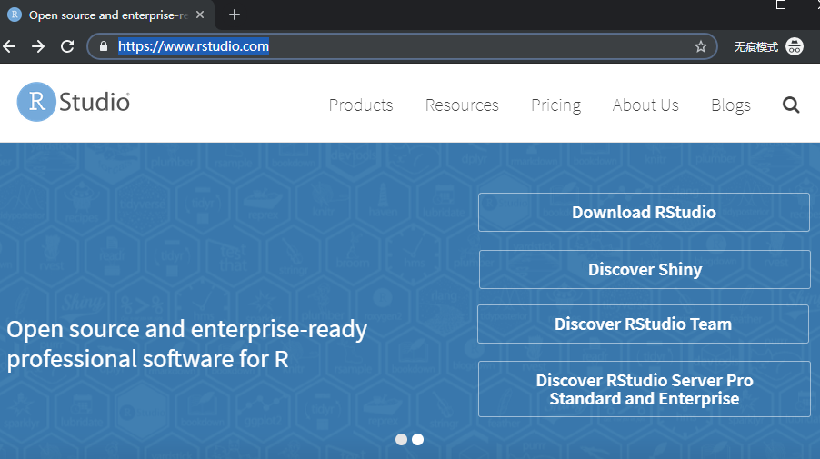
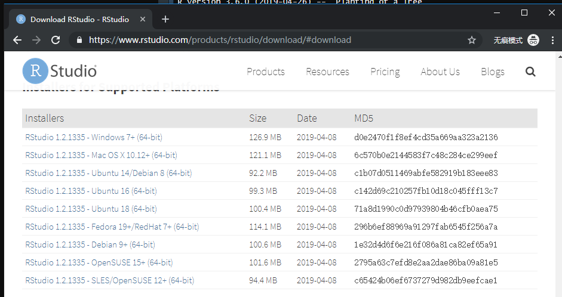
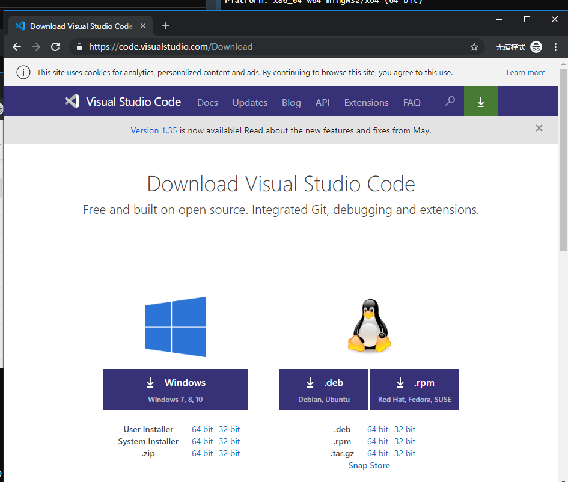
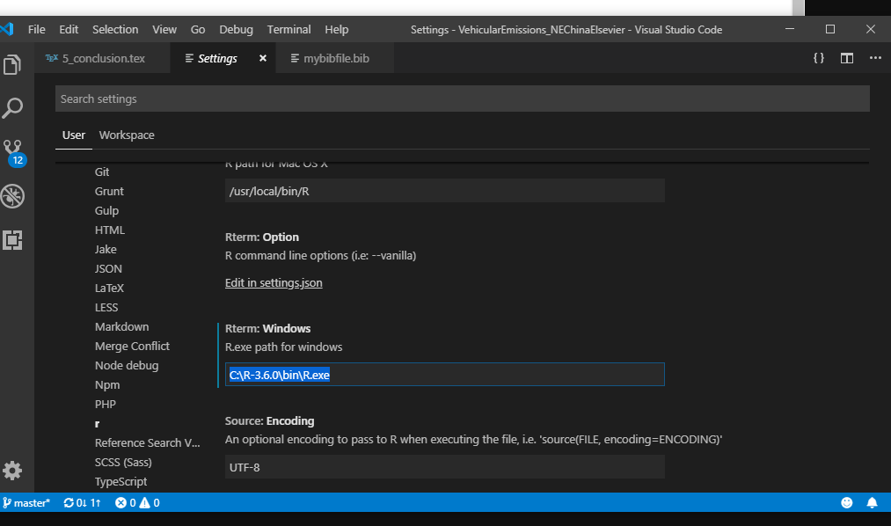

# Introduction {#intro}

CHN

在开始课程之前，请按照下列步骤操作：

ENG

Before starting the course, follow these steps: 

## Install R

CHN

以这种方式下载R：

1.进入此网页：https：//cran.r-project.org/mirrors.html

2.进入任何中国镜子


ENG

Download R in this way:

1. Go into this web page: https://cran.r-project.org/mirrors.html
2. Enter into any Chinese mirror


```{r, echo = F}

```
CHN

例如，让我们进入https://mirrors.tuna.tsinghua.edu.cn/CRAN/
在那里你点击你的系统并下载

ENG 

3. For instance, lets enter into https://mirrors.tuna.tsinghua.edu.cn/CRAN/
There you click on your system and download

```{r, echo = F}

```


## Install Rstudio

CHN 

进入https://www.rstudio.com，点击Rstudio下载并点击免费下载并安装。

ENG

Go into https://www.rstudio.com, click on Rstudio Download and click on FREE and download and install.


```{r, echo = F}

```


```{r, echo = F}

```


## Install packages

```{r, eval=F}
install.packages(c("ggplot2", "cptcity", "sf", "raster", "stars", "data.table",
                   "readr", "readxl", "lubridate"))
```


## Get the data

```{r eval = FALSE}
dir.create("data")
download.file(
  url = "https://github.com/ibarraespinosa/RIGA/raw/master/data/china_cities_20190413.xlsx", 
  destfile = "data/china_cities_20190413.xlsx")
```


Download all the files from this link

https://github.com/ibarraespinosa/RIGA/tree/master/data


## Learn more


Check https://bookdown.org/

## Install VSCODE (optional)

CHN

如果您喜欢Visual Studio（或其他文本编辑器），则可以在其上运行R. 进入此网站并下载并安装

ENG 

If you like Visual Studio (or other text editor), you can run R on it. Go into this web and download and install


https://code.visualstudio.com/Download


```{r, echo = F}

```


CHN

然后，单击设置，扩展名，r并将路径放在安装R的位置

ENG

Then, click on settings, extensions, r and put the path where you installed R


```{r, echo = F}

```

