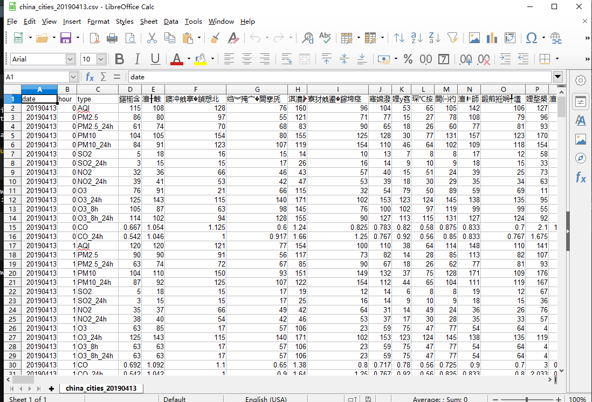

# Excel，我的老朋友 - Excel, my old friend 

## Spreadsheets

```{r, echo = F, fig.cap="Libreoffice Calc with some Chinese data"}

```

CHN

有时我们必须使用电子表格（Excel）分析数据。 如果数据很小且分析很简单，则没有问题。 但是什么
如果我们有数百万的混合观察会发生？ 使用Excel可能不是一个好主意。

**做（5分钟）**
打开文件china_cities_20190413.xlsx
检查数据
将其导出为.CSV
使用Block Notes打开.CSV文件

ENG

Sometimes we must analize data using spreadsheets (Excel). If the data is small and the analyses is simple, there are no problems. But what 
happens if we have millions of mixed observations? Using Excel might be not a good idea. 

**do (5 min)**
Open the file china_cities_20190413.xlsx
Check the data
Export it to .CSV
Open the .CSV file using Block Notes


## 将数据导入R - Importing data into R

### 阅读Excel - Reading Excel

```{r}
library(readxl)
df <- read_xlsx("data/china_cities_20190413.xlsx")
names(df)
head(df)
```


### 使用基础 - Using base

```{r}
df <- read.csv("data/china_cities_20190413.csv")
names(df)
```


### 使用data.table - Using data.table

data.table比python，julia，spark和dask更快

data.table is faster than python, julia, spark and dask

**https://h2oai.github.io/db-benchmark/**

```{r}
library(data.table)
df <- fread("data/china_cities_20190413.csv")
df
```

Here is a review of existing methods.


You can label chapter and section titles using `{#label}` after them, e.g., we can reference Chapter \@ref(intro). If you do not manually label them, there will be automatic labels anyway, e.g., Chapter \@ref(methods).

Figures and tables with captions will be placed in `figure` and `table` environments, respectively.

```{r nice-fig, fig.cap='Here is a nice figure!', out.width='80%', fig.asp=.75, fig.align='center'}
par(mar = c(4, 4, .1, .1))
plot(pressure, type = 'b', pch = 19)
```

Reference a figure by its code chunk label with the `fig:` prefix, e.g., see Figure \@ref(fig:nice-fig). Similarly, you can reference tables generated from `knitr::kable()`, e.g., see Table \@ref(tab:nice-tab).

```{r nice-tab, tidy=FALSE}
knitr::kable(
  head(iris, 20), caption = 'Here is a nice table!',
  booktabs = TRUE
)
```

You can write citations, too. For example, we are using the **bookdown** package [@R-bookdown] in this sample book, which was built on top of R Markdown and **knitr** [@xie2015].
